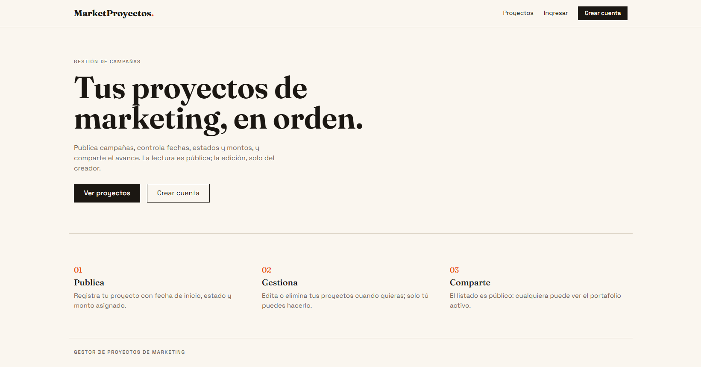
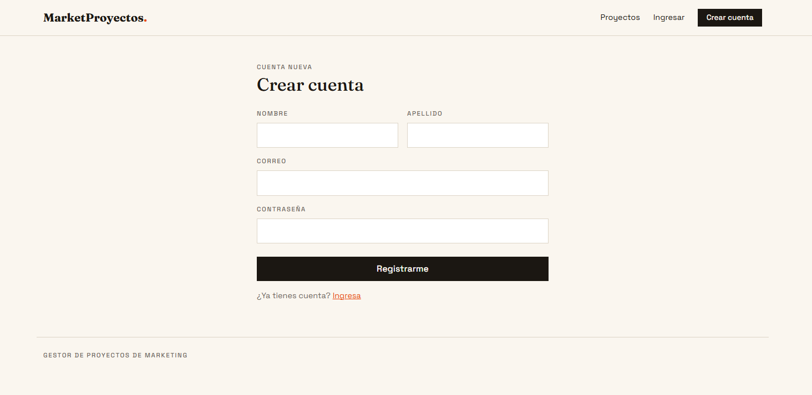
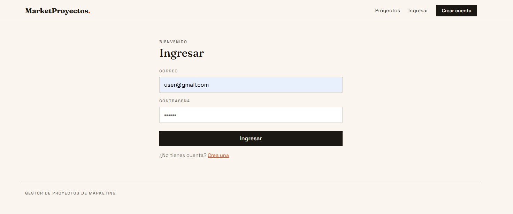
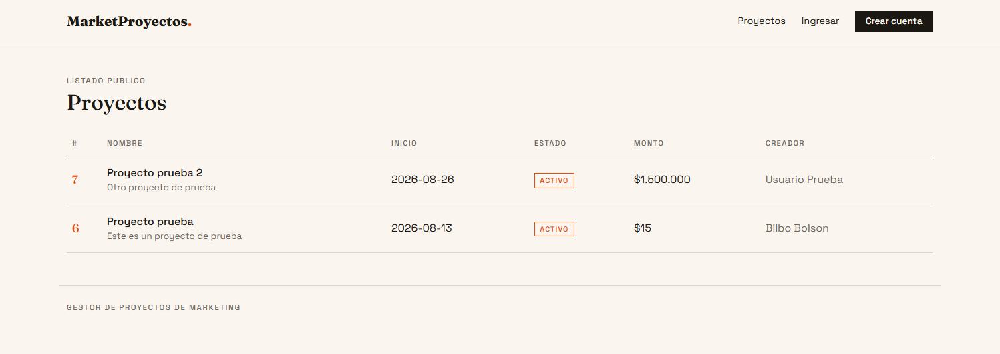
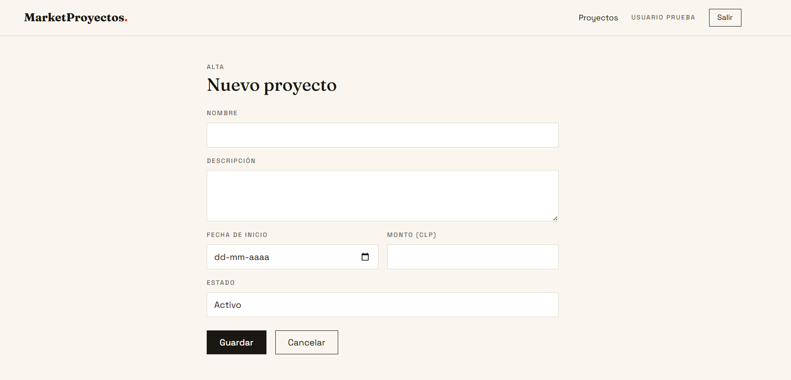

# eva2-desarrollo-web

Gestor de proyectos de marketing. App web MVC en Node.js + TypeScript + Express, con vistas Handlebars (Bootstrap por CDN) y API REST. Los usuarios se registran y publican/editan/eliminan sus propios proyectos; la lectura es pública y solo el creador (`created_by`) puede modificar su proyecto.

## Stack

- **Node 24** — ejecuta TypeScript nativamente (type stripping), sin paso de build
- **Express 5** + **express-handlebars** — vistas en `src/views`
- **Prisma ORM 7 + PostgreSQL en Supabase** (`@prisma/adapter-pg`) — persistencia relacional
- **argon2** — hash de contraseñas
- **JWT en cookie** — sesión
- TypeScript solo como typechecker (`tsc --noEmit`)

## Decisión de base de datos

Se utilizó **PostgreSQL en Supabase** porque se necesitaba una base de datos relacional: los datos del proyecto son relacionales por naturaleza. Un `Usuario` puede crear múltiples `Proyecto`, y cada proyecto pertenece a un único usuario mediante la relación `created_by`. PostgreSQL permite representar esta relación con claves foráneas, mantener la integridad referencial y garantizar restricciones como el correo único de cada usuario. Supabase aloja esta base PostgreSQL y la aplicación se conecta mediante Prisma.

## CRUD del proyecto

| Operación | Descripción | Vistas | API | Acceso |
|---|---|---|---|---|
| **Crear** | Registra un proyecto y lo asocia al usuario autenticado mediante `created_by`. | `POST /proyectos` | `POST /api/proyectos` | Autenticado |
| **Leer** | Lista proyectos públicamente; la API también permite consultar un proyecto por ID. | `GET /proyectos` | `GET /api/proyectos` y `GET /api/proyectos/:id` | Público |
| **Actualizar** | Modifica nombre, descripción, fecha, estado y monto del proyecto. | `GET/POST /proyectos/:id/editar` | `PUT /api/proyectos/:id` | Solo el creador |
| **Eliminar** | Elimina el proyecto seleccionado. | `POST /proyectos/:id/eliminar` | `DELETE /api/proyectos/:id` | Solo el creador |

La autorización de actualización y eliminación verifica que el usuario autenticado coincida con `created_by`.

## Modelos

| Modelo | Campos |
|---|---|
| **Usuario** | id, nombre, apellido, correo (único), password (hash argon2) |
| **Proyecto** | id, nombre, descripcion, fechaInicio, estado (default `activo`), monto (CLP), created_by → Usuario |

## Rutas

### Vistas (`src/routes/index.ts`)

| Método | Ruta | Acceso |
|---|---|---|
| GET | `/` | Público |
| GET/POST | `/registro` | Público |
| GET/POST | `/login` | Público |
| POST | `/logout` | Autenticado |
| GET | `/proyectos` | Público |
| GET | `/proyectos/nuevo` | Autenticado |
| POST | `/proyectos` | Autenticado |
| GET | `/proyectos/:id/editar` | Solo creador |
| POST | `/proyectos/:id/editar` | Solo creador |
| POST | `/proyectos/:id/eliminar` | Solo creador |

### API (`src/routes/api.ts`, prefijo `/api`)

| Método | Ruta | Acceso |
|---|---|---|
| GET | `/api/health` | Público |
| POST | `/api/auth/register` | Público |
| POST | `/api/auth/login` | Público |
| GET | `/api/proyectos` | Público |
| GET | `/api/proyectos/:id` | Público |
| POST | `/api/proyectos` | Autenticado |
| PUT | `/api/proyectos/:id` | Solo creador |
| DELETE | `/api/proyectos/:id` | Solo creador |

## Requisitos

- Node.js 24+

## Instalación

```bash
git clone https://github.com/ailyne-amador/eva2-desarrollo-web
cd eva2-desarrollo-web
npm install
```

Crear `.env` en la raíz con la conexión PostgreSQL de Supabase:

```env
DATABASE_URL="postgresql://postgres.<PROJECT_REF>:<PASSWORD>@aws-0-<REGION>.pooler.supabase.com:5432/postgres"
JWT_SECRET="cambia-esto"
```

Aplicar las migraciones versionadas en Supabase y regenerar el cliente:

```bash
npx prisma migrate deploy
npx prisma generate
```

## Uso

```bash
npm run dev        # node --watch src/app.ts (auto-reload)
npm start          # sin watch
npm run typecheck  # verificar tipos
```

Servidor en `http://localhost:3000` (o `PORT` en el entorno).

## Funcionalidades

### Inicio



Página de bienvenida pública. Presenta el propósito de la app y resume las tres acciones principales (publicar, gestionar y compartir), con accesos directos al listado de proyectos y al registro de cuenta. No requiere autenticación.

### Registro de usuario



Formulario de creación de cuenta (`/registro`). Solicita nombre, apellido, correo y contraseña. La contraseña se almacena hasheada con argon2 y el correo es único por usuario. Tras registrarse, el usuario puede publicar sus propios proyectos.

### Inicio de sesión



Formulario de acceso (`/login`) con correo y contraseña. Al autenticarse correctamente se emite un JWT que viaja en una cookie, manteniendo la sesión activa. La barra de navegación muestra el nombre del usuario y la opción de salir.

### Listado de proyectos



Listado público (`/proyectos`) visible sin cuenta. Muestra cada proyecto con su nombre, descripción, fecha de inicio, estado, monto formateado en CLP y el nombre de su creador.

### Crear proyecto



Formulario de alta (`/proyectos/nuevo`), disponible solo para usuarios autenticados. Permite ingresar nombre, descripción, fecha de inicio, monto en CLP y estado. El proyecto queda asociado al usuario que lo creó (`created_by`), y solo ese usuario puede editarlo o eliminarlo después.


## Estructura

```
src/
  app.ts                  # bootstrap: handlebars, middlewares, routers
  auth.ts                 # JWT: loadUser, requireAuthView, requireAuthApi
  validar.ts              # validación de formularios
  models/db.ts            # cliente Prisma con adaptador PostgreSQL de Supabase
  controllers/            # controladores de vistas
    api/                  # controladores de API
  routes/
    index.ts              # viewRoutes (vistas, en root)
    api.ts                # apiRoutes (detrás de /api)
  views/                  # plantillas Handlebars (layout: layouts/main.handlebars)
prisma/
  schema.prisma           # modelos Usuario / Proyecto
  migrations/
```

- ESM (`"type": "module"`); imports entre archivos con extensión `.ts` explícita.
- Sin enums ni namespaces de TS (type stripping no los soporta).
- PostgreSQL en Supabase es la fuente de persistencia; la aplicación local necesita conexión a Internet.
- No versionar `.env` ni sus credenciales.
- Autorización por `created_by`: editar/eliminar verifica que el usuario autenticado sea el creador.
